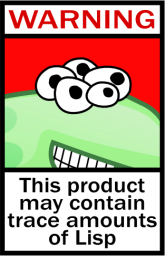

## Golangで
## 小さなLispインタプリタ
## を作ってみた
### 0x64物語 Reboot \#09
@otakumesi

---

## みなさん、木といったらなにを思い浮かべますか？

---

## クリスマスツリー、木構造、二分木、...

---

# Lisp

---

## Lisp
カッコが多いとかで敬遠されがちな言語  
マスコットキャラのLispエイリアンが可愛い  
Haskell共和国と戦争中らしい（某書によると）  
<font color="red">LIS</font>t <font color="red">P</font>rocessorを略した名称に由来  

---

## Lispエイリアン





---

## Lispの構文は木構造
簡単なLispのコードを見てみましょう。
```lisp
(+ (* 1 (+ 3 4)) (- 5 (/ 10 5)))
;; => 10
```

---

## Lispの構文は木構造
ちゃんとインデントをつけてみてみると、  
木構造に見えてきませんか？
```lisp
(+
  (* 1
    (+ 3 4))
  (- 5
    (/ 10 5)))
;; => 10
```

---

## Lispの構文は木構造
Lispの構文のS式はそのまま構文木になります

<pre style="width: 130px;display:inline-block;"><code class="lang-lisp hljs"><span class="line">(<span class="hljs-name">+</span></span><span class="line">  (<span class="hljs-name">*</span> <span class="hljs-number">1</span></span><span class="line">    (<span class="hljs-name">+</span> <span class="hljs-number">3</span> <span class="hljs-number">4</span>))</span><span class="line">  (<span class="hljs-name">-</span> <span class="hljs-number">5</span></span><span class="line">    (<span class="hljs-name">/</span> <span class="hljs-number">10</span> <span class="hljs-number">5</span>)))</span><span class="line"><span class="hljs-comment">;; =&gt; 10</span></span></code></pre>

<pre style="width: 130px;display:inline-block;">
     +
   /   \
  *     -
 / \   / \
1   +  5  ÷
   / \   / \
  3   4 10  5
</pre>

---

## GolangでLispを
## 実装した話

---

## 動機

- Golangで挑戦できるいい題材を探してた
- (元)Emacs使いとしての目標の一つだった
- 0x64物語のお題が「木」だった

---

## デモ（REPL）


---

## 最初の発想

「Lispは木構造なので、S式の頂点から要素を再帰的に評価していけば、葉までたどり着いて結果を返せそう」

---

## ゆるふわなクラス図


---

## 反省

* 初期実装を勢いで書いたため「純LISP」の仕様の確認が遅くなった
  * そして「カッコがいっぱいあるだけでLispじゃなくね？」と気がついて、途中でそれなりに書き直した
  * 未だにLispの仕様がゆるふわ......
* Compositeパターンを意識して書いたらもう少しキレイな設計になった気がする

---

### 開発中にGolangに対して思ったこと

* メソッドオーバーロード欲しい
* オプション引数欲しい
* 例外欲しい

(生粋のGopherさんにマサカリ投げられそう)

---

### オプション引数の代替

FunctionalOptionPatternを使って解決した
```
type Option func(*Sexpr)error

func Rhs(rhs Evaler)error {
  return func(*Sexpr)error {
    return s.SetRhs(rhs)
  }
}

func NewSexpr(opts ...Option) {
  ...
}
```
---

## でも、最終的に...

Golangを書いてるとなぜだか心地よくなってきて、そんなことどうでもよくなりました（？）

---

### せっかくなのでHTMLを書いてみた


---

GolangでLispをテンプレートエンジンっぽく使って
LambdaからHelloWorldした図（？）


---

これをツイートしたらmattnさんに、  
こんなコメントを貰えたので僕は満足しました


---

# 終わり
